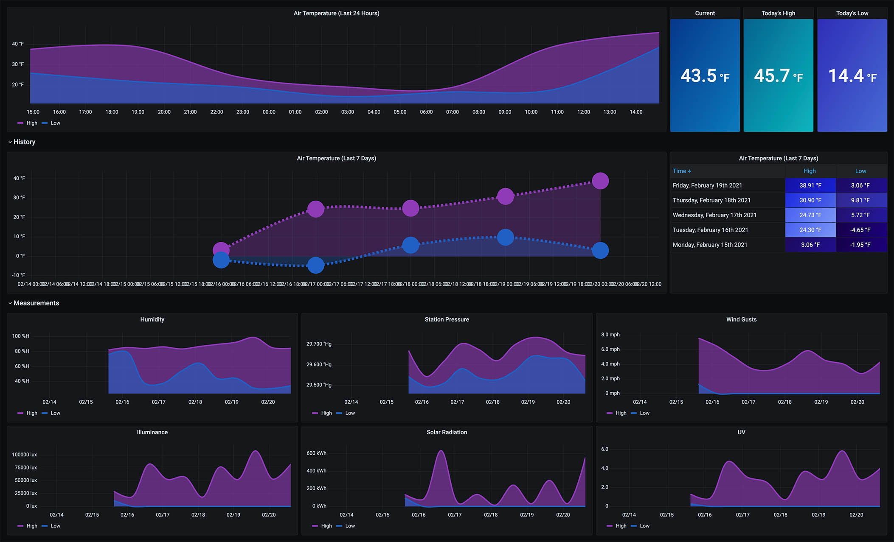
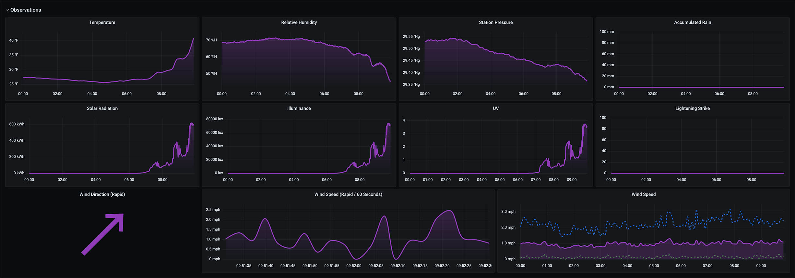
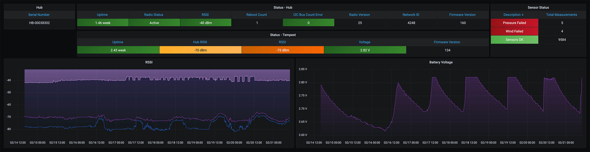
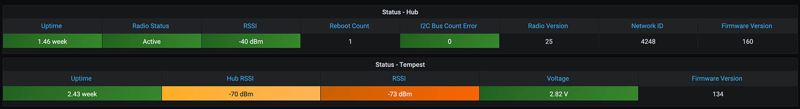
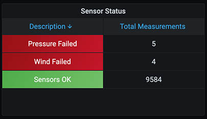
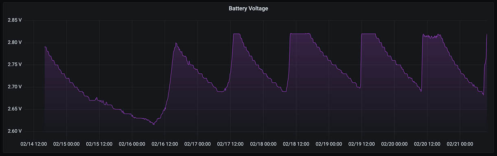
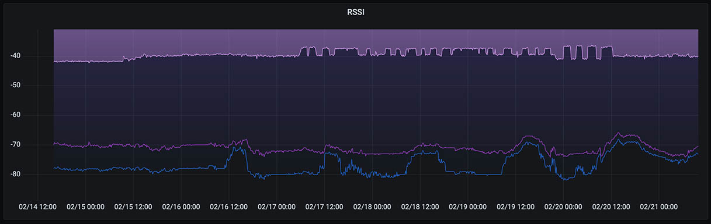

## About The Project

**Grafana WeatherFlow** is an example project put together to help you get up and running quickly with a UDP collector to visualize your raw [WeatherFlow Tempest](https://weatherflow.com/tempest-weather-system/) log stream with Grafana dashboards. 

This project uses [Grafana Promtail](https://grafana.com/docs/loki/latest/clients/promtail/) and a simple [UDP Python collector](https://github.com/p-doyle/Simple-WeatherFlow-Python-Listener) from [P Doyle](https://github.com/p-doyle/) to forward raw JSON logs to a [Grafana Loki](https://grafana.com/oss/loki/) log aggregation backend.  Several pre-configured [Grafana dashboards](https://grafana.com/oss/grafana/) are provided which utilizes Loki's easy to use *metrics from logs* to visualize WeatherFlow data over time.

WeatherFlow Tempest -> WeatherFlow Hub -> UDP Collector (port 50022) -> Grafana Promtail -> Grafana Loki <- Grafana Dashboards

## Getting Started

The project is built around a pre-configured Docker stack containing the following containers:

 - [Grafana](https://grafana.com/oss/grafana/)
 - [Grafana Loki](https://grafana.com/oss/loki/)
 - [WeatherFlow UDP Listener](https://github.com/p-doyle/Simple-WeatherFlow-Python-Listener)

## Prerequisites

- [Docker](https://docs.docker.com/install)
- [Docker Compose](https://docs.docker.com/compose/install)

## Using

To get started, download one of [the releases](https://github.com/lux4rd0/grafana-weatherflow/releases) from this repository and extract it into an empty directory. For example:

    wget https://github.com/lux4rd0/weatherflow-dashboards-aio/archive/v0.91-beta.zip
    unzip v0.91-beta.zip
    cd grafana-weatherflow-v0.91-beta

## Data Retention and Storage Locations

The raw logs collected from the WeatherFlow UDP collector get sent over to Grafana's Loki log aggregation system. The storage for that data is persisted into a local filesystem mount outside of the Loki container. Because of the user permissions inside the container needing to match the local file system - there are some updates needed to map the UID (user ID) and GID (group ID) for both.

There are three scripts you can use to start, stop, and remove docker containers that help with this mapping:

`up.sh` `stop.sh`,  and `down.sh`

It looks at the user running the commands and sets a variable for the UID and GID that docker-compose then uses to start the Loki container.

    export UID_GID="$(id -u):$(id -g)" 

You can either update the `docker-compose.yml` file with these settings, change the up.sh and down.sh scripts, or change the file permissions to reflect the Loki container requirements.

UID `10001` and GID `10001`

This uses the /data/loki folder to store the Loki data files. Update the `docker-compose.yml` file if you want to place it someplace else on your file system.

## Startup

If using the `up.sh` `stop.sh`,  and `down.sh` scripts:

### Start

    bash ./up.sh

### Stop

    bash ./stop.sh

### Remove

    bash ./down.sh

### Manually

From the above directory, run the docker-compose command:

    export UID_GID="$(id -u):$(id -g)" 
    docker-compose -f docker-compose.yml up -d

This will start to download the Grafana and Loki application containers (**Grafana** and **Grafana Loki**) and it builds the **WeatherFlow Listener** container. The "`-d`" command places the containers into "detached" mode *(run containers in the background)*. The configuration also sets each of the containers to auto-start.

*Note, this project is built and tested on Linux CentOS 7.* 

## Grafana Dashboards

Once all of the docker containers are started up, point your Web browser to the Grafana page, typically http://hostname:3000/ - with hostname being the name of the server you ran the `docker-compose up -d` command on. The "**WeatherFlow - Overview**" dashboard is defaulted without having to log into Grafana.

There are two other dashboards that can be viewed by selecting the "WeatherFlow Dashboards" drop down from the top righthand side of the dashboards:

**WeatherFlow - Today So Far**

The last hour over time for Temperature, Relative Humidity, Station Pressure, Accumulated Rain, Solar Radiation, Illuminance, UV, Lightening Strike, and Wind Speed. Rapid Wind Direction and Wind Speed over the last 60 seconds is also updated every 5 seconds (by default). 

**WeatherFlow - Device Details**

Provides the current status for both the Tempest and WeatherFlow hub such as Uptime, Radio Status, RSSI, Reboot Count, I2C Bus Count Error, Radio Version, Network ID, Firmware Version, and Voltage.

Another panel provides an overview of Sensor Status measurements - either "Sensors OK" or if there were any failures.

There's also RSSI and Battery Voltage over time defaulted to the the last 7 days.

## Default Security

This docker-compose stack is designed to be as easy as possible to deploy and go. Anonymous logins have been enabled and the default user has a **Viewer** role. This can be changed to either an **Admin** or **Editor** role by changing the Grafana environmental variable in the `docker-compose.yml` file to:*

    GF_AUTH_ANONYMOUS_ORG_ROLE: Viewer

## Downloading Grafana WeatherFlow Dashboards Individually

The dashboards included in this Grafana WeatherFlow stack can also be downloaded separately if so desired:

- [WeatherFlow - Overview](https://grafana.com/grafana/dashboards/13938)
- [WeatherFlow - Today So Far](https://grafana.com/grafana/dashboards/13939)
- [WeatherFlow - Device Details](https://grafana.com/grafana/dashboards/13940)

## Roadmap

See the open issues for a list of proposed features (and known issues).

## Contributing

Contributions are what make the open source community such an amazing place to be learn, inspire, and create. Any contributions you make are greatly appreciated.

- Fork the Project
- Create your Feature Branch (git checkout -b feature/AmazingFeature)
- Commit your Changes (git commit -m 'Add some AmazingFeature')
- Push to the Branch (git push origin feature/AmazingFeature)
- Open a Pull Request

## Contact

Dave Schmid - [@lux4rd0](https://twitter.com/lux4rd0) - dave@pulpfree.org
Project Link: https://github.com/lux4rd0/grafana-weatherflow

## Acknowledgements

- Grafana Labs - https://grafana.com/
- Grafana - https://grafana.com/oss/grafana/
- Grafana Dashboard Community - https://grafana.com/grafana/dashboards
