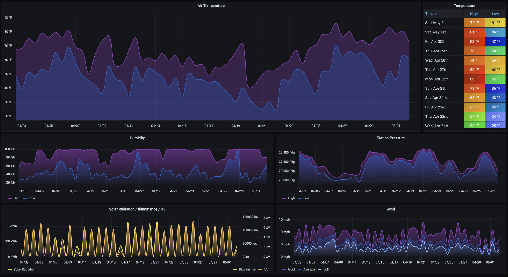

## About The Project

**WeatherFlow Dashboards AIO** is an example project put together to help you get up and running quickly with a local-udp, remote-socket, and remote-rest collector to visualize your [WeatherFlow Tempest](https://weatherflow.com/tempest-weather-system/) log streams with Grafana dashboards. 

This project uses my custom [weatherflow-collector](https://github.com/lux4rd0/weatherflow-collector) and a slightly updated [UDP Python collector](https://github.com/p-doyle/Simple-WeatherFlow-Python-Listener) from [P Doyle](https://github.com/p-doyle/) to collect and transform JSON logs to metrics and publish them to an InfluxDB TSDB.  Several pre-configured [Grafana dashboards](https://grafana.com/oss/grafana/) provide visualizations of WeatherFlow data over time. I also include additional visualizations using WeatherFlow's Cloud APIs to populate forecasts and derived weather metrics.

WeatherFlow Tempest -> WeatherFlow Hub -> UDP Collector (port 50222) InfluxDB <- Grafana Dashboards

remote-socket/remote-rest <- weatherflow-collector -> InfluxDB

A live set of dashboards using this collector [are available](https://labs.lux4rd0.com/weatherflow-collector/) for you to try out.

## Getting Started

The project is built around a pre-configured Docker stack containing the following containers:

 - [Grafana](https://grafana.com/oss/grafana/)
 - [InfluxDB 1.8](https://docs.influxdata.com/influxdb/v1.8/)
 - [WeatherFlow Collector](https://github.com/lux4rd0/weatherflow-collector)

## Prerequisites

- [Docker](https://docs.docker.com/install)
- [Docker Compose](https://docs.docker.com/compose/install)

## Notice

This personal project tends to stay in a state of flux based on trying out new things and seeing what works and what doesn't. It started as a fun exercise to visualize "what's possible," and I'm experimenting with different collectors and backends. Please plan on breaking changes along the way.

## Using

To get started, download one of [the releases](https://github.com/lux4rd0/grafana-weatherflow/releases) from this repository and extract it into an empty directory. For example:

    wget https://github.com/lux4rd0/weatherflow-dashboards-aio/archive/v3.2.0.zip
    unzip v3.2.0.zip
    mv weatherflow-dashboards-aio-3.2.0 weatherflow-dashboards-aio
    cd weatherflow-dashboards-aio

Correct environmental variables need to be set for the containers to function. The following script should be used:

    generate_docker-compose_aio.sh

To use it, you will need to provide your WeatherFlow token as environmental variables.

    WEATHERFLOW_COLLECTOR_IMPORT_DAYS #optional
    WEATHERFLOW_COLLECTOR_LOKI_CLIENT_URL #optional
    WEATHERFLOW_COLLECTOR_THREADS
    WEATHERFLOW_COLLECTOR_TOKEN

An example would be:

    WEATHERFLOW_COLLECTOR_IMPORT_DAYS="365" \
    WEATHERFLOW_COLLECTOR_THREADS="4" \
    WEATHERFLOW_COLLECTOR_TOKEN="a22afsa7-0dcc-4918-9f9a-923dfd339f41c" \
    bash ./generate_docker-compose_aio.sh

The following files will be generated for you:

#### docker-compose.yml

Running `docker-compose up -d' will spin up several containers for each of the types of data available to you. (Listed below) If you have more than one hub on your account - please edit the docker-compose.yml file to only have your hub local to your network. If you have more than one device, those will also be added and can remain.

#### Optional:
#### remote-import-<<station_name>>.sh

This script will spin up a docker container to import all of the observed metrics in the WeatherFlow cloud. Having an import function may be helpful if you're starting with this WeatherFlow Collector or if you've reset your InfluxDB database. It essentially loads in over your local UDP data. If you have more than one device, a separate import file will be generated for each.

## Obtaining Your Tempest Authentication Token

You can obtain your authentication token by signing in to the Tempest Web App at [tempestwx.com](tempestwx.com), then go to Settings -> Data Authorizations -> Create Token.

## Data Retention and Storage Locations

Data is stored in InfluxDB in a mounted directory under /data/influxdb. By default, there is no retention policy set.

### Startup

From the above directory, run the docker-compose command after you've generated the docker-compose.yml file:

    docker-compose up -d

This command will start to download the Grafana, InfluxDB, and weatherflow-collector application containers. The" `-d'" command places the containers into "detached" mode *(run containers in the background)*. The configuration also sets each of the containers to auto-start.

*Note, this project has been tested on 64-bit CentOS 7 (centos-release-7-9.2009.1.el7.centos.x86_64) and 32-bit Raspberry Pi 4 (Raspberry Pi OS/January 11th 2021)*

https://github.com/lux4rd0/weatherflow-collector#using

## Grafana Dashboards

Once all of the Docker containers have started, point your Web browser to the Grafana page, typically http://hostname:3000/ - with hostname being the name of the server you ran the `docker-compose up -d' command on.

### Alerts

Coming soon - a set of Grafana alerts to let you know of deviations in expected collector performance or weather metrics change.

### Current Conditions

This dashboard provides a comprehensive overview of your station location, combining all "at-a-glance" metrics from your WeatherFlow device. The current conditions dashboard is divided up into:

- **Temperature & Wind**: observed, feels like, forecast high and low, the chance of precipitation, humidity, sea level pressure, UV, wind speed, and direction.)

- **Sunrise & Sunset and Sky Conditions**

- **Temperature & Brightness**: Heat index, wind chill, dry bulb, wet bulb, dew point, station pressure, brightness, solar radiation, and air density.

- **Rain & Lightning**: Rain accumulation (today and yesterday), rain duration (today and yesterday), lightning last detected, last distance, and the number of lightning detections during the previous 3 hours.

### Device Details

This dashboard provides the current status for both the Tempest and your WeatherFlow hub, such as Uptime, Radio Status, RSSI, Reboot Count, I2C Bus Count Error, Radio Version, Network ID, Firmware Version, and Voltage.

RSSI and Battery Voltage over time defaulted to the last seven days are shown at the top of the dashboard, while current device details are shown below.

Sensor Status measurements are shown with a number related to each per minute collection from the device. Either "Sensors OK" is down or any failures, which sensor had the error. Note that if you have the Lightning Disturber enabled, you may see a high number of failures as electromagnetic interference is being suppressed.

### Forecast

Provides both a daily and hourly forecast in table format with charts below them. The default time range includes the current day plus the next nine upcoming days. The interval drop-down at the top defaults to 12 hours to provide for highs and lows forecasts. Clicking on any of the dates in the "Forecast - Daily" table will refresh the Forecast hourly table to that day's hourly forecasts. This can also be done from the top "Forecast Day" drop-down menu.

### Forecast Vs. Observed

As forecast data is collected, this dashboard may be used to compare what was forecasted (by how many days out) versus the observed metric from your WeatherFlow device. Temperature, Humidity, Wind, and UV measurements are covered here. By default, "All" available forecast days are overlayed over the observed metric. You can choose different "Days Out" from the top drop-down menu to compare individual forecasts.

### Historical (local-udp)

Provides a place to view weather details over longer periods of time. It defaults to 30 days with a 12-hour interval to show highs and lows for each of the Air Temperature, Humidity, Station Pressure, Solar, and Wind metrics. Precipitation Accumulation is displayed for any days that precipitation is detected.

### Historical (remote)

Provides a place to view weather details over longer periods of time. It defaults to 30 days with a 12-hour interval to show highs and lows for each of the Air Temperature, Humidity, Station Pressure, Solar, and Wind metrics. Includes [derived metrics](https://weatherflow.github.io/Tempest/api/derived-metric-formulas.html)  as well such as Feels Like, Heat Index, Wind Chill, Dry Bulb, Wet Bulb, and Dew Point. Precipitation Accumulation is displayed for any days that precipitation is detected.

### Overview

Overview is the default landing page for the WeatherFlow Collector AIO. It provides an overview of current weather metrics and live updates for Wind and direction. From here, you can choose other dashboards from the top right-hand dashboard panel or the top left-hand side drop-downs under "WeatherFlow Collector Dashboards".

### Rain and Lightning

A historical view (defaulted to seven days) shows both the precipitation rate alongside the daily accumulation. As you zoom into the specific precipitation events, change the Interval drop-down to smaller increments (up to 1-minute collections) for finer rates.

For Lightning, Strikes and Distance show on a heatmap visualization. Time is across the x-axis while the number of detected lightning strikes is bucketed by color (dark blue to yellow). The Y-axis shows the bucketed distances (up to 40 miles away). Hover over each of the squares to see a histogram of each strike/distance count.

### System Stats

Provides for two different system metrics to understand the health of your weatherflow-collector. At the top shows which container is running and each of the times that it last started. A default Docker health check is enabled for each container that requires some data to be received and persisted every 60 seconds, or the container is marked unhealthy. This check happens every 5 seconds and will restart the container after three failed checks.

The second section shows how long it's taking to receive and persist forecasts and observations.

 - Forecast Build Duration - Daily - between 1 and 2 seconds
 Forecast Build Duration - Hourly - between 30 and 45 seconds (note - if this takes longer than 60 seconds, the Docker Health Check will currently recycle the container. A future update will change this to take a longer build duration into account. For now - set the "WEATHERFLOW_COLLECTOR_DOCKER_HEALTHCHECK_ENABLED" environmental variable to "false".
 - Rest Observations - between 1 and 2 seconds

### Today So Far (local-udp)

The dashboard provides for Temperature, Relative Humidity, Station Pressure, Accumulated Rain, Solar Radiation, Illuminance, UV, Lightning Strike, and Wind Speed from midnight to the current time. These reflect the direct measurements from the local-udp collector (or imported from WeatherFlow).

### Today So Far (remote)

This dashboard provides for the Temperature (Air, Feels Like, Heat Index, Wind Chill, Dry Bulb, Wet Bulb, and Dew Point), Relative Humidity, Air Density, Station Pressure (with Trending), Accumulated Rain, Solar Radiation, Illuminance, UV, Lightning Strike, and Wind Speed from midnight to the current time. These reflect the WeatherFlow measurements from data sent to WeatherFlow and include [derived metrics](https://weatherflow.github.io/Tempest/api/derived-metric-formulas.html) in the response.

## Default Security

This docker-compose stack is designed to be as easy as possible to deploy and go. Anonymous logins have been enabled, and the default user has a **Viewer** role. This setting can be changed to either an **Admin** or **Editor** role by changing the Grafana environmental variable in the `docker-compose.yml` file to:*

    GF_AUTH_ANONYMOUS_ORG_ROLE: Viewer

## Downloading WeatherFlow Grafana Dashboards Individually

The dashboards included in this WeatherFlow Dashboards AIO stack can also be [downloaded separately](https://github.com/lux4rd0/weatherflow-collector) if so desired.

## Roadmap

See the open issues for a list of proposed features (and known issues).

## Contributing

Contributions make the open source community such a fantastic place to learn, inspire, and create. Any contributions you make are greatly appreciated.

- Fork the Project
- Create your Feature Branch (git checkout -b feature/AmazingFeature)
- Commit your changes (git commit -m 'Add some AmazingFeature')
- Push to the Branch (git push origin feature/AmazingFeature)
- Open a Pull Request

## Contact

Dave Schmid - [@lux4rd0](https://twitter.com/lux4rd0) - dave@pulpfree.org
Project Link: https://github.com/lux4rd0/grafana-weatherflow

## Acknowledgements

- Grafana Labs - https://grafana.com/
- Grafana - https://grafana.com/oss/grafana/
- Grafana Dashboard Community - https://grafana.com/grafana/dashboards
